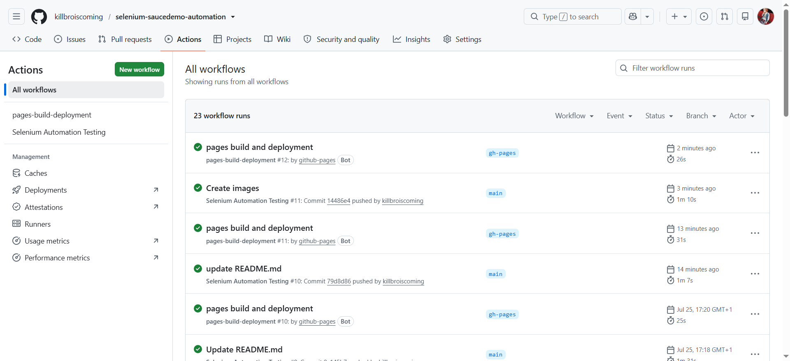
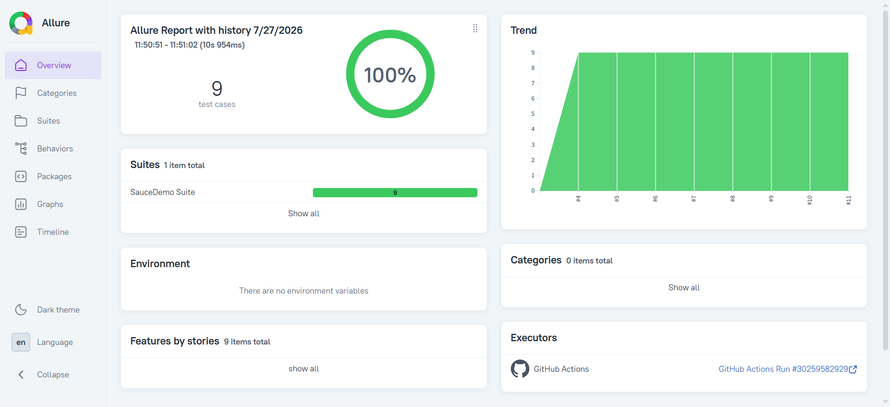
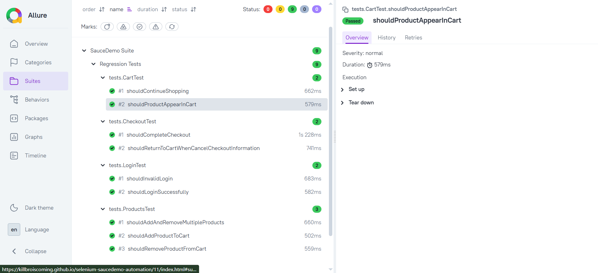
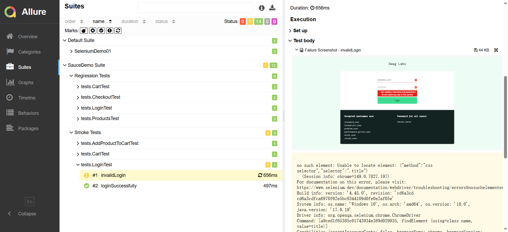
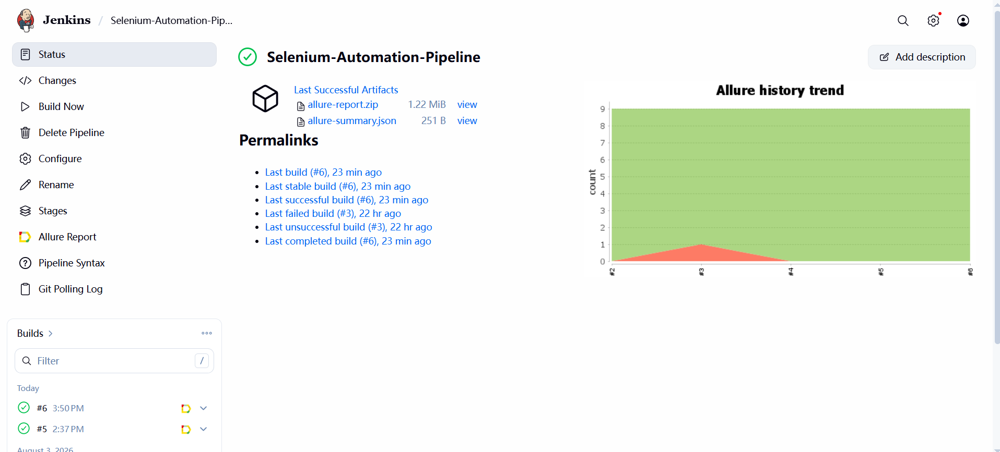
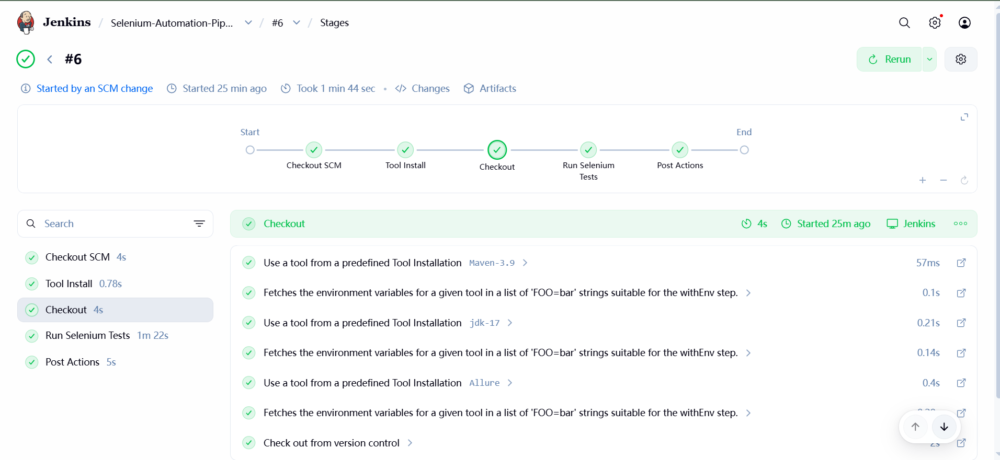
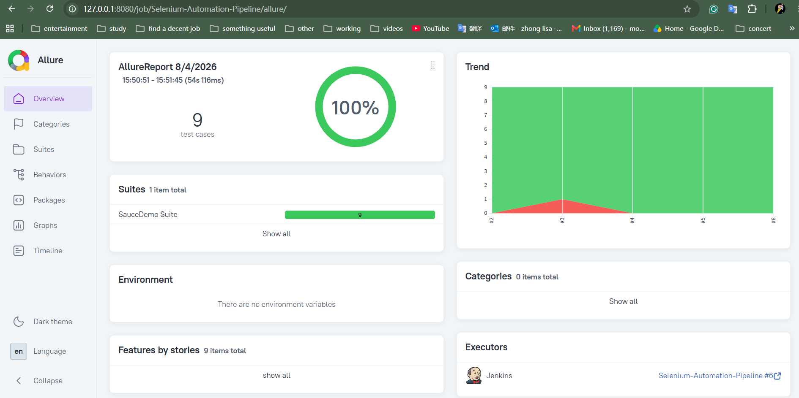

# Selenium Java Test Automation Framework
[](https://github.com/killbroiscoming/selenium-saucedemo-automation/actions/workflows/ui-tests.yml)

A scalable UI test automation framework built with **Java**, **Selenium WebDriver**, **TestNG**, and **Maven**, following the **Page Object Model (POM)** design pattern.

The project demonstrates how modern UI automation frameworks are designed for maintainability, reusability, and continuous integration. It includes retry mechanisms, automatic screenshot capture, Allure reporting, GitHub Actions, and Jenkins Pipeline integration.

The framework automates end-to-end user journeys on the SauceDemo e-commerce application and serves as a portfolio project showcasing enterprise automation testing practices.

## Project Overview

This project demonstrates how to design a maintainable Selenium automation framework following industry best practices.

The framework separates page objects, reusable Selenium actions, configuration, listeners, and test logic into independent layers, making it easy to maintain and extend as new pages and test scenarios are added.

## Live Demo

| Resource | Link |
|----------|---|
| 🚀 Live Allure Report | https://killbroiscoming.github.io/selenium-saucedemo-automation/ |
| ⚙️ GitHub Actions | https://github.com/killbroiscoming/selenium-saucedemo-automation/actions |


## Tech Stack

| Category | Technology         | Version |
|-----------|--------------------|---------|
| Language | Java               | 17 |
| UI Automation | Selenium WebDriver | 4.x |
| Test Framework | TestNG             | 7.x |
| Build Tool | Maven              | 3.x |
| Design Pattern | Page Object Model  | — |
| Reporting | Allure Report      | 2.x |
| CI/CD | GitHub Actions     | Latest |
| CI/CD | Jenkins            | Latest |
| Report Hosting | GitHub Pages       | — |
| Version Control | Git                | Latest |
| Repository Hosting | GitHub             | — |
| IDE | IntelliJ IDEA      | 2025+ |

## Project Structure

```text
selenium-java-testng-automation-framework
│
├── src
│   ├── main
│   │   ├── java
│   │   │   ├── base
│   │   │   ├── pages
│   │   │   └── utils
│   │
│   └── test
│       ├── java
│       │   ├── base
│       │   ├── listeners
│       │   └── tests
│       └── resources
│
├── .github
│   └── workflows
│       └── selenium-tests.yml
│
├── docs
│   └── images
├── pom.xml
├── testng.xml
├── Jenkinsfile
├── .gitignore
└── README.md
```

## Framework Features

### Framework Design

- Page Object Model (POM)
- Reusable BasePage methods
- Centralized WebDriver management
- Configuration via `config.properties`
- Utility classes for reusable functions
- Layered architecture

### Test Automation

- End-to-end UI automation
- Clean Page Object implementation
- Retry mechanism
- Screenshot capture on failure
- Explicit waits
- Readable and maintainable test design

### Reporting

- Allure Report integration
- Screenshot attachments
- Test execution history
- GitHub Actions workflow
- Automatic GitHub Pages deployment


## Automated Test Coverage

| Feature | Status |
|----------|--------|
| Valid Login | ✅ |
| Invalid Login | ✅ |
| Products Page Validation | ✅ |
| Add Product to Cart | ✅ |
| Remove Product from Cart | ✅ |
| Cart Badge Validation | ✅ |
| Cart Verification | ✅ |
| Checkout Process | ✅ |
| Checkout Cancellation | ✅ |
| Continue Shopping | ✅ |


## Framework Architecture

The framework follows a layered architecture to separate business scenarios from UI interactions.

```text
              Test Classes
                    │
                    ▼
              Page Objects
                    │
                    ▼
               Base Page
                    │
                    ▼
        Selenium WebDriver
                    │
                    ▼
                Web Browser
```

Each layer has a single responsibility.

- **Test Classes** contain business scenarios.
- **Page Objects** encapsulate page interactions.
- **BasePage** provides reusable Selenium operations.
- **WebDriver** communicates with the browser.

This design minimizes duplicated code and improves maintainability as the project grows.

## Continuous Integration

This project demonstrates both cloud-based and self-hosted Continuous Integration.

### GitHub Actions

Every push or pull request automatically triggers the following workflow:

```

Git Push

↓

GitHub Actions

↓

Checkout Repository

↓

Set up Java

↓

Maven Build

↓

Run Selenium Tests

↓

Generate Allure Results

↓

Publish GitHub Pages

```

---

### Jenkins Pipeline

The same framework is executed using a Jenkins Declarative Pipeline.

```

Checkout

↓

Compile

↓

Run UI Tests

↓

Generate Allure Report

↓

Archive Screenshots

↓

Build Complete

```

---

## CI/CD Architecture

```

Developer

│

Git Push

│

┌──────────────┴──────────────┐

│                             │

▼                             ▼

GitHub Actions          Jenkins Pipeline

│                             │

└──────────────┬──────────────┘

▼

Maven Build

▼

Selenium + TestNG

▼

Allure Report

▼

GitHub Pages / Jenkins

```

---

## Jenkins Pipeline

The project contains a Declarative Jenkins Pipeline (`Jenkinsfile`) that automates the complete UI testing workflow.

Example:

```groovy
pipeline {

    agent any

    stages {

        stage('Checkout') {
            steps {
                checkout scm
            }
        }

        stage('Build & Test') {
            steps {
                bat 'mvn clean test'
            }
        }

    }

}
```

---

## Screenshots

### GitHub Actions

The CI pipeline automatically builds the project, executes Selenium tests, and publishes the Allure report.



---

### Allure Overview



---

### Test Details



---

### Failure Screenshot

When a UI test fails, the framework automatically captures a screenshot and attaches it to the Allure report.



### Jenkins Dashboard



### Jenkins Job Stage



### Jenkins Allure Overview




## Running the Project

Clone the repository.

```bash
git clone https://github.com/killbroiscoming/selenium-saucedemo-automation.git
```

Navigate into the project.

```bash
cd selenium-saucedemo-automation
```

Execute all tests.

```bash
mvn clean test
```


## Configuration

Create a `config.properties` file.

```properties
baseUrl=https://www.saucedemo.com/
username=standard_user
password=secret_sauce
firstname=Test
lastname=User
postalCode=SW1A1AA
```


## Reporting

After execution, reports are generated in:

```text
allure-results/
screenshots/
target/
```

Generate the Allure report locally.

```bash
allure serve allure-results
```

The report includes:

- Test execution summary
- Pass/Fail status
- Stack traces
- Failure screenshots
- Retry history


## Screenshot Capture

When a test fails, the `ScreenshotListener` automatically captures a screenshot and attaches it to the Allure report to simplify debugging.


## Retry Mechanism

The framework includes a reusable `RetryAnalyzer` that automatically retries transient test failures caused by temporary browser synchronization or page loading issues.

Persistent failures should be investigated rather than relying on retries.


## Future Improvements

- Docker Support
- Selenium Grid
- Parallel Execution
- Cross-browser Execution
- GitHub Actions Matrix Builds
- Environment Profiles
- Data-driven Testing
- API Automation Integration (Rest Assured)
- Slack Notifications
- Playwright UI Automation


## Author
**Lisha Zhong**

QA Automation Engineer

**Skills**

- Java
- Selenium WebDriver
- TestNG
- Maven
- Git
- GitHub Actions
- Jenkins
- Allure Report
- UI Automation
- Page Object Model (POM)
- Test Automation Framework Design